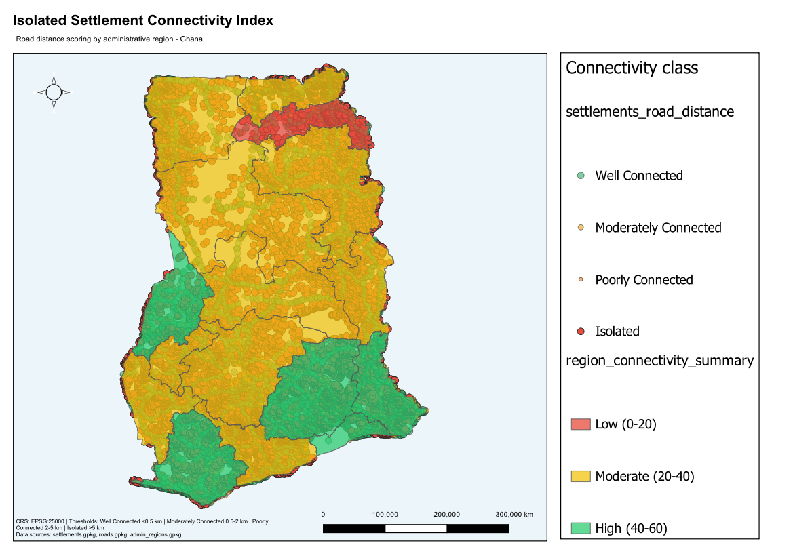

# Isolated Settlement Connectivity Index

**Country:** Ghana
**CRS:** EPSG:25000 - Leigon / Ghana Metre Grid
**Project file:** `Isolated_Settlement_Connectivity_Index.qgz`

---

## Overview

This project classifies all settlements in Ghana by their connectivity to the road network, producing a four-tier connectivity index. Each settlement is assigned a distance-to-road value and categorised as Isolated, Poorly Connected, Moderately Connected, or Well Connected. A regional summary aggregates the connectivity distribution across administrative units, supporting rural access planning and infrastructure gap prioritisation.

## Reference Layout

---

## Objectives

- Compute the distance from every settlement to the nearest road segment.
- Classify settlements into four connectivity tiers based on distance thresholds.
- Summarise connectivity class distribution by administrative region.
- Extract the isolated settlement subset for targeted planning use.

## Methodology

1. Settlements and roads reprojected to EPSG:25000.
2. Nearest road distance computed for each settlement using hub-distance analysis: `settlements_road_distance.gpkg`.
3. Distance-based connectivity tiers applied:
   - **Well Connected:** within 500 m of road
   - **Moderately Connected:** 500 m - 2 km
   - **Poorly Connected:** 2 km - 5 km
   - **Isolated:** greater than 5 km from any road
4. Isolated settlements extracted to `isolated_settlements.gpkg`.
5. Regional connectivity summary generated: `region_connectivity_summary.gpkg`.

## Settlement Count by Connectivity Class

| Class | Settlement Count |
|-------|-----------------|
| Well Connected | 5,093 |
| Moderately Connected | 3,624 |
| Poorly Connected | 6,887 |
| Isolated | 9,738 |
| **Total** | **25,342** |

> 38.4% of Ghana's settlements are classified as Isolated (more than 5 km from any road).

## Output Layers

| File | Description |
|------|-------------|
| `settlements_road_distance.gpkg` | All settlements with nearest road distance and connectivity class |
| `isolated_settlements.gpkg` | Settlements classified as Isolated (> 5 km from road) |
| `region_connectivity_summary.gpkg` | Regional polygons with connectivity class counts and proportions |

## Key Findings

- Nearly 10,000 settlements (38.4% of the national total) are classified as Isolated, more than any other single class.
- Poorly Connected and Isolated settlements together represent over 65% of all settlements, indicating that the majority of Ghana's populated places lack practical road proximity.
- Northern and Savannah regions contain the highest proportions of isolated settlements, aligning with the lowest road density rankings in the network density analysis.

## Deliverables

| File | Type |
|------|------|
| `Isolated_Settlement_Connectivity_Index.qgz` | QGIS project |
| `Isolated_Settlement_Connectivity_Index.pdf` | Exported map layout |
| `reference_layout.png` | Print layout reference image |

## Notes

- All layers use EPSG:25000 (Leigon / Ghana Metre Grid). Total feature count: 25,342 settlements across 16 regions.
- Distance thresholds (500 m, 2 km, 5 km) represent general planning conventions; they should be adjusted for specific programme eligibility criteria.

---

## Map Preview

